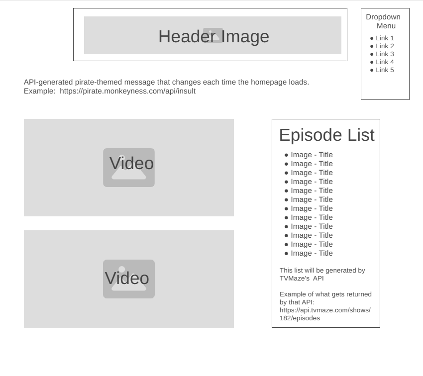
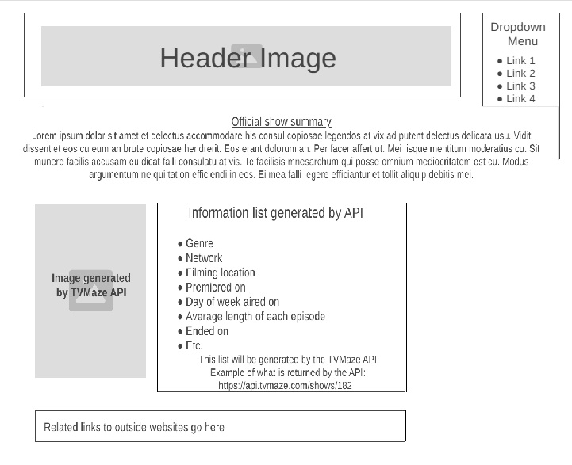
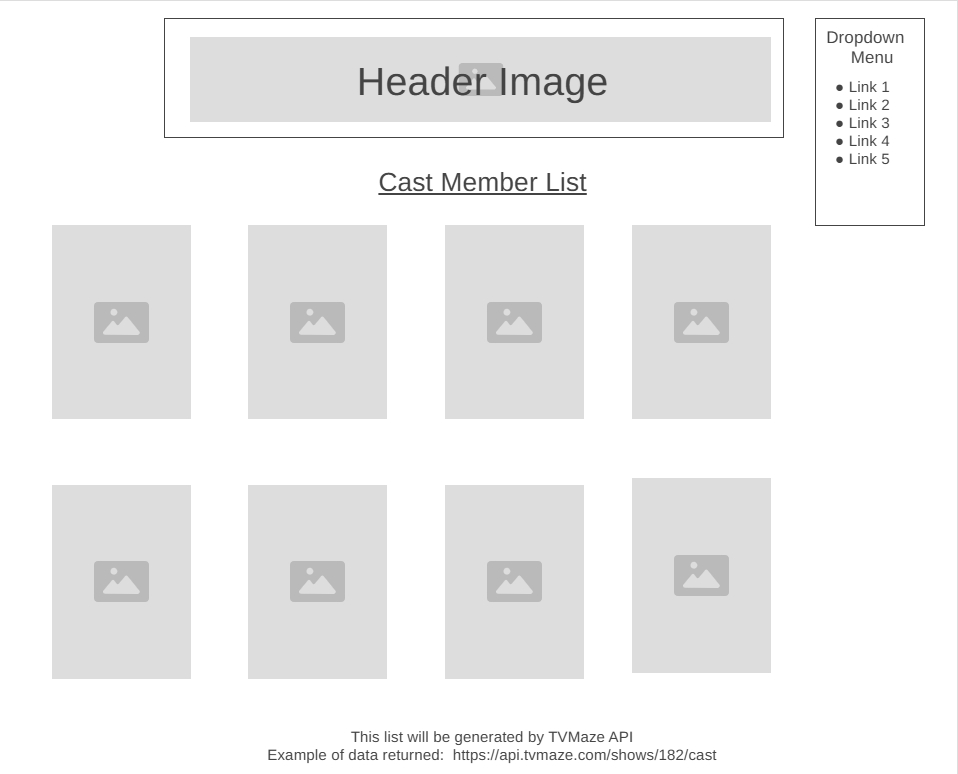
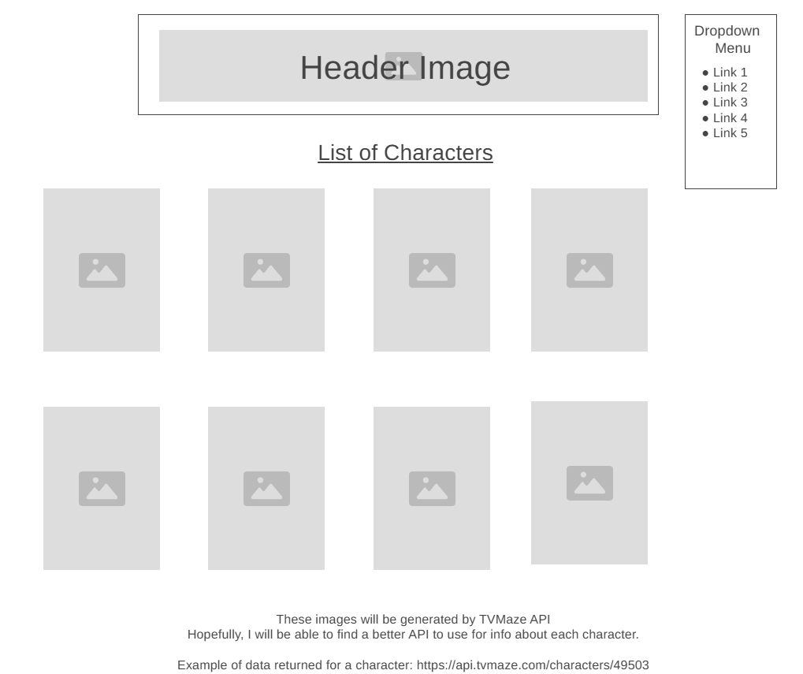

# Project Proposal

A fan website for the tv show "Black Sails"

## Basic Info:

**Title:**

**Elevator Pitch:**

## APIs:

* [TVMaze API](https://www.tvmaze.com/api)
* [REST Countries](https://restcountries.com/)
* Random pirate greeting API (Most likely will need to be created by myself since I haven't yet found a CORS-compliant one)

## Other Dependencies

* Embeddable podcast player widget provided free from [Elfsight](https://elfsight.com/)

## Tasks to be completed:

* Checkout `development` branch
* Setup/Create a Vite React app
* Install Prop-types and React Router
* Add BrowserRouter to `main.jsx`
* Add any necessary image files (from the public domain) that won't be provided by the APIs
* Create `Header.jsx` containing header title image and dropdown menu for website navigation
* Create `RoutePaths.jsx` containing route paths to the various urls of the website
* Edit `App.jsx` so that it returns `Header` followed by `Routepaths`
* Create files (including codes to call the various APIs & display the results) which will generate the various pages of the website
* Incorporate prop-types as needed
* Edit `App.css` contents as each page's file is created, to style the pages
* Incorporate unit testing
* Deploy website onto a publicly accessible web server
* Perform basic user testing
* Submit pull request (with zip file) for grading ☺️

## Plan:

## Header:

The header will appear on all pages of the website.  It will consists of a title image and a dropdown menu.  The title image will be a link that will lead back to the homepage when clicked on.  The dropdown menu will contain links to all of the pages of the website.

## Homepage:

The homepage will use the ["Episodes List" section of the TVMaze API](https://api.tvmaze.com/shows/182/episodes) to generate the episode list, and a second API that will randomly generate a welcome message similar to [this pirate API](https://pirate.monkeyness.com/api.html).

The videos will be season preview trailers, using the "embed" codes provided by YouTube.

### Wireframe:

## Stats page:

The contents of this page will make use of the ["Show main information"](https://api.tvmaze.com/shows/182) section of the TVMaze API.

### Wireframe:

## Cast  page:

Images and some basic information about each actor will be displayed by using the ["Cast"](https://api.tvmaze.com/shows/182/cast) section of the TVMaze API.

### Wireframe:

## Characters page:

The images on this page will be generated by the ["Characters"](https://api.tvmaze.com/characters/49503) section of the TVMaze API.

TVMaze has summary description paragraphs about each character [(example)](https://www.tvmaze.com/characters/49503/black-sails-captain-james-flint) , but for some reason those descriptive summaries don't seem to be returned from the API call. ☹️ Therefore, I will need to find or build a second API to generate information about each character, such as those character descriptions.

Clicking on a character's image on this page will lead to another page with that information about the character, similar to how the Star Wars homework assignment operated.

### Wireframe:

## Podcast page

When asked what sort of content she would most want on a fansite for a tv show (in general), a friend answered that she would enjoy learning more behind-the-scenes insights from the writers and cast.  Thankfully, the ["Fathoms Deep" podcast](https://commonroomradio.com/podcasts/fathoms-deep/) did just that for this show by interviewing the producers, writers, cast, and others! Since [Elfsight](https://elfsight.com/) offers a free widget that can easily embed a podcast player onto a website, I will use that to provide access to listen to the "Fathoms Deep" podcast on this page.

### Wireframe:

## Learning page

When asked what sort of content he would most want on a fansite for "Black Sails" (in specific), a different friend answered that he would enjoy learning more about the historical figures who were portrayed in the show.
