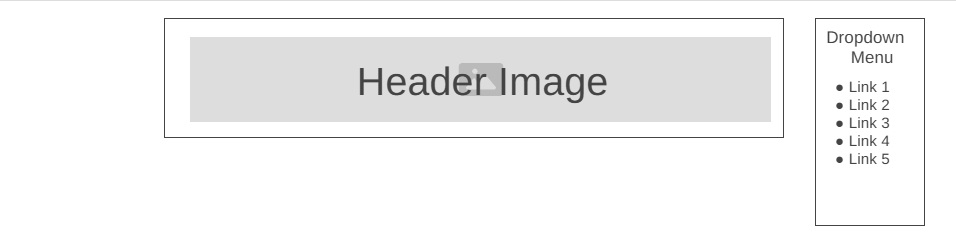
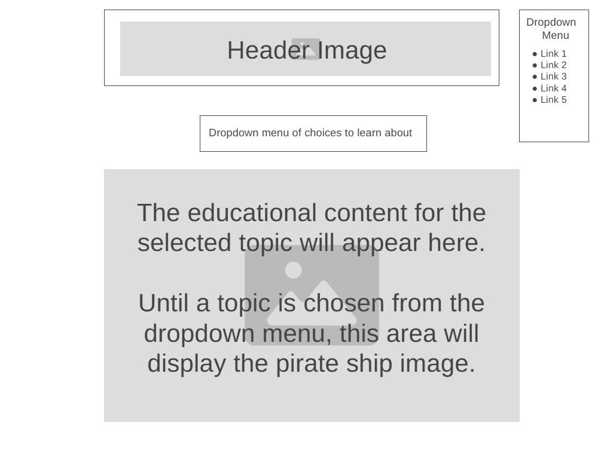

# Project Proposal

A fan website for the tv show "Black Sails"

## Basic Info:

**Title:** _"Governor Augustus Featherstone's Complete and Accurate, Totally Fictional Journal of Who's Who in Nassau Town Circa 1715."_

Explanatory note:  The named person (Featherstone) in the project title is one of the characters in the show who starts off as a pirate but finishes at the end of the series as a governor of Nassau because of his skills in accounting and keeping records. The project title is written in a manner that is reminiscent of how that fictional character might name a journal.

**Elevator Pitch:**

"Black Sails" is a loosely historical, action-adventure television series set in the Caribbean (and some scenes in England) a few decades before the U.S. fought for independence from Britain, featuring a mix of fictional pirates from the novel "Treasure Island" and real life historical figures (mostly pirates).  It loosely serves as an adult-level (nudity, violence, gore) prequel to "Treasure Island" and tells a complete story of richly complicated characters (especially Captain Flint and Long John Silver) across 4 seasons. Despite featuring movie-quality costumes/sets, starring some award-winning actors, receiving favorable reviews from both critics and audiences, and winning awards for both visual effects and music/sound editing, popular knowledge about the show remains weak, possibly due to it having originally aired during the height of "Game of Thrones" popularity on a less popular channel (Starz).

The timing for a new fansite for the show is especially good because Netflix only just added the show to their streaming options last year.

## APIs:

* [TVMaze API](https://www.tvmaze.com/api)
* [REST Countries](https://restcountries.com/)
* [Library of Congress API](https://www.loc.gov/apis/)
* Random pirate greeting API (Most likely will need to be created by myself since I haven't yet found a CORS-compliant one)

## Other Dependencies

* Embeddable podcast player widget provided free from [Elfsight](https://elfsight.com/)
* Firebase
* React dependencies (prop-types, router, etc.)

## Tasks to be completed:

* Checkout `development` branch
* Setup/Create a Vite React app
* Install Prop-types and React Router
* Add BrowserRouter to `main.jsx`
* Add any necessary image files (from the public domain) that won't be provided by the APIs
* Create `Header.jsx` containing header title image and dropdown menu for website navigation
* Create `RoutePaths.jsx` containing route paths to the various urls of the website
* Edit `App.jsx` so that it returns `Header` followed by `Routepaths`
* Create files (including codes to call the various APIs & display the results) which will generate the various pages of the website
* Incorporate prop-types as needed
* Edit `App.css` contents as each page's file is created, to style the pages
* Incorporate unit testing
* Deploy website onto a publicly accessible web server
* Perform basic user testing
* Submit pull request (with zip file) for grading ☺️

 

## Wireframe - Header:

The header will appear on all pages of the website.  It will consists of a title image and a dropdown menu.  The title image will be a link that will lead back to the homepage when clicked on.  The dropdown menu will contain links to all of the pages of the website.

 

## Wireframe - Homepage:

The homepage will use the ["Episodes List" section of the TVMaze API](https://api.tvmaze.com/shows/182/episodes) to generate the episode list, and a second API that will randomly generate a welcome message similar to [this pirate API](https://pirate.monkeyness.com/api.html).

The videos will be season preview trailers, using the "embed" codes provided by YouTube.

 

## Wireframe - Stats page:

The contents of this page will make use of the ["Show main information"](https://api.tvmaze.com/shows/182) section of the TVMaze API.

 

## Wireframe - Cast page:

Images and some basic information about each actor will be displayed by using the ["Cast"](https://api.tvmaze.com/shows/182/cast) section of the TVMaze API.

 

## Wireframe - Characters page:

The images and names on this page will be generated by accessing the ["Characters"](https://api.tvmaze.com/characters/49503) section of the TVMaze API.

TVMaze has summary description paragraphs about each character [(example)](https://www.tvmaze.com/characters/49503/black-sails-captain-james-flint) , but for some reason those descriptive summaries don't seem to be returned from the API call. ☹️ Therefore, I will need to find or build a second API to generate information about each character, such as those character descriptions.

Ideally, clicking on a character's image on this page will lead to another page with that information about the character, similar to how the Star Wars homework assignment operated.

 

## Wireframe - Podcast page

When asked what sort of content she would most want on a fansite for a tv show (any show in general), a friend answered that she would enjoy learning more behind-the-scenes insights from the writers and cast.  Thankfully, the ["Fathoms Deep" podcast](https://commonroomradio.com/podcasts/fathoms-deep/) did just that for this show by interviewing the producers, writers, cast, and others! Since [Elfsight](https://elfsight.com/) offers a free widget that can easily embed a podcast player onto a website, I will use that to provide access for users to listen to the "Fathoms Deep" podcast on this page.

 

## Wireframe - Learning page

When asked what sort of content he would most want on a fansite for "Black Sails" (in specific), a different friend answered that he would enjoy learning more about the historical facts and figures who were portrayed in the show.  Thankfully, the Library of Congress seems to have several pirate-related historical documents/images [and an API to access them with](https://www.loc.gov/apis/). The most feasible option would probably be to set up a dropdown menu of choices that responds by displaying onto the page the contents of whichever information option is selected. For example, one of the dropdown choices could be ["The Pirates Own Book"](https://www.loc.gov/item/16008172/), which (if selected by the user) would then display onto the screen [the Library of Congress image scans of that book](https://www.loc.gov/resource/gdcmassbookdig.piratesownbook00ellm_0/?st=gallery).

Since the majority of the show takes place in the Bahamas, it also makes sense to make one of the dropdown options be to learn facts about that country, which can be delivered onto the page via the [REST Countries API](https://restcountries.com/v3.1/name/Bahamas?fullText=true).

Since [a relatively nice pirate-esque sailing ship exists in the public domain for free](https://www.publicdomainpictures.net/pictures/610000/velka/sail-ships-in-the-ocean-waves.jpg) I plan on setting up the page so that that image appears until a menu option is chosen.  Once a learning menu option is selected, that image div would be replaced by a new div containing the requested info.

  

## Plan:

Week 1:

* Planning
* Resource gathering

Week 2: 

* Create app, install dependencies, and adjust main.jsx and App.jsx files.
* Create the needed files (header and main skeletons of the 6 landing pages - Homepage, Stats, Cast, Characters, Podcast, and Learn More page).
* Set up the embeddable podcast widget and put it on the Podcast page.
* Code the needed API calls/results per page.
  1. The bulk of the Homepage, Stats, Cast, and Characters landing page should be finished first since they should be relatively fast/easy API-related pages to set up.
  2. Figuring out the [random pirate greeting generator](https://pirate.monkeyness.com/api/insult) on the homepage will probably take slightly more time, since it seems like I might need to create my own.  Therefore, tackling that should come second.
  3. I expect that setting up an info paragraph about each character (that would appear when the character's image is clicked on from the Characters page) might take some time as well, since I haven't yet found an API that returns that data (I might need to write it myself). If need be, I can omit that feature from the website, however, since a page with just the character images/names (which [the TVMaze API can provide](https://api.tvmaze.com/characters/49505)) could suffice.  So solving the character info paragraph feature should come after solving the homepage greeting.
  4. Using the Library of Congress API for the Learn More page (and then installing the dropdown menu to access it) seems like it will be the most time-consuming (and potentially hardest) part of the project. It should therefore come after finishing the other API-related pages.
* Use CSS as each page is created, to style the page.
* Any additional time remaining can be spent creating additional "Nice to Have" features

Week 3:

* Finish any lingering unfinished tasks from the prior week.
* Incorporate unit testing.
* Solve any errors/glitches that are occurring.
* Deploy onto publicly accessible web server.
* Perform basic user testing and adjust according to feedback.
* Complete any final CSS touches.
* Turn in the assignment for grading and present the project in class.

 

## "Nice to Have" Potential Extra Features

If there is enough extra time, it might be nice to create a page with a Vingt-Un game, since I already have experience from last semester with both coding the basic skeleton of one and with that API, assuming that API is CORS-compliant.

I also have been discussing with friends the idea of creating some sort of "favorites/wish list" functionality for perusing related merchandise on the internet, but that idea is far less developed. Since I am not yet sure how it would function nor how it would integrate into the rest of the website, it is far less likely to be tackled.  It would be better to finish polishing the rest of the website instead, but it seemed worth mentioning since it has remained a vague idea of another potential extra for the website.
