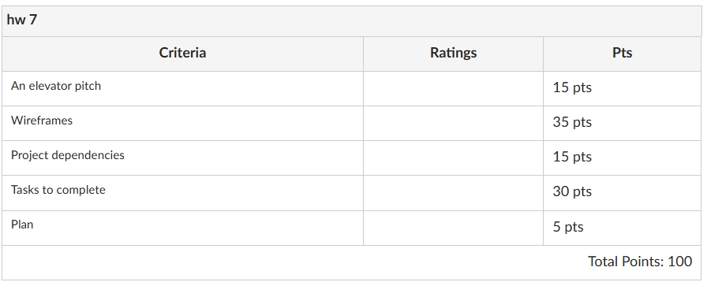

# Week 7, Assignment 5

Your assignment for this week is to think of a final project idea and create a plan for the project.

## Final Project Requirements

* The project must be a React application, bootstrapped with `Vite`
* Your app must be created using the repo created from accepting the Final Project assignment on GitHub Classroom in Canvas.
* Your app must be your own work. You may work in a group of up to **3 people** if you'd like, but be aware that you'll need to come up with a strategy for working together. Most developers on small projects create branches for new features/fixes, then merge them back into the `main` branch. Merge conflicts can arise, and you'll need to resolve them as you go.
  * The simplest and most straightforward workflow for each team member:
    ```bash
    # create a branch off of main
    git checkout main
    git branch -b feat/new-feature-name

    # commit code to this branch
    git add .
    git commit -m 'more code'

    # periodically push to GitHub
    git push
    ```
  #### Project Requirements
  * App should do something and be working in a publicly avalible url.
  * App must fetch an exeternal api, whether that is a publicly available API or a database that you have created (for example firebase), must use fetch API, not external fetching libaries.
  * App must use routes, at minimum 2 routes and should use React Router.
  * Your app should be deployed onto a web server and publicly accessible.
  * App should use prop types
  * Incorporates at least one unit test
  * App uses modern JS (Functional components, Arrow functions, etc)
  * Work on feature branches (i.e. `development`) and merge in code into `main`. Pull requests allow us to make comments
  * Your app should be *polished*. Some recommendations for this requirement:
  * Remove `console.log` statements once you're finished with development
  * Utilize CSS and images to make your app look professional
  * Check for any React errors in the console
  * Perform some basic user testing. Have other people use your app and receive feedback on usability
  * Keep your feature set small, so you'll have time to polish the app

Other than the above requirements, you're encouraged to be creative and create something you're proud of. It can be as simple or as complex as you want, and it should be high quality.

## Assignment Requirements

Above are the requirements for the project. For this week however, you'll need to create a plan for your project. More details are to come, but you'll need to create a pull request with the following:

* The name of your project
* An elevator pitch (a paragraph about what your project does). Be sure to address:
  * Who will use your project
  * The value that your project will provide to the end user
* [Wireframes](https://en.wikipedia.org/wiki/Website_wireframe) to help visualize what your project will look like
  * These wireframes do not have to be high-fidelity. You're free to use boxes, hand drawings, tools such as Draw.io, etc.
* A list of dependencies you'll be using for your project (npm modules, APIs, Firebase, etc.)
  * This list will likely change as you work on your project, but listing your dependencies will help you visualize the complexity of the project
* A list of tasks that need to be completed for your project
  * Example list of tasks for the Star Wars films example:
    * Setup `vite` scaffold
    * Call the Star Wars API and print results
    * Store API results in React component state
    * Render React state
* A plan for the next 3 weeks and what you plan to accomplish each week

## Recommendations

* Keep the scope of your project small. A small, completed project is much better than a large, incomplete project. You can create a list of "nice to have" features that you can work on if you have time (similar to how our assignments have a main list of requirements and "bonus" items).
* Ensure you have plenty of buffer time in your schedule. Life events pop up, and tasks can take longer than initially estimated.

## Submitting your Project Idea

1. Add your project name, elevator pitch, wireframes, dependencies, task list, and plan to the GitHub repo (you can add a markdown file + images or links to images)
2. Create a pull request
3. Create a zip file of your repo for submission to Canvas.

## Grading


