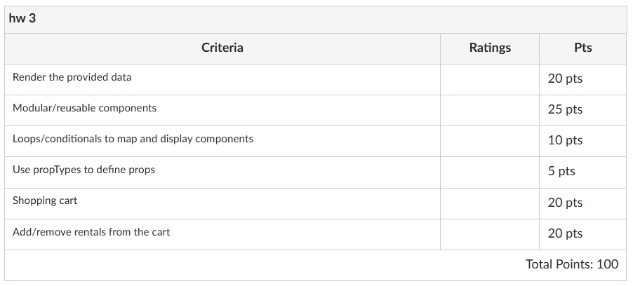

# Week 3 Homework Assignment

## Getting Started

1. Clone the repository to your machine.
2. Setup your application
   ```bash
   # Make sure you run this command inside the week3 folder. Check via `pwd`
   # Not doing so may cause the Vite command to fail
   pwd
   # /path/to/week3-assignment
   npm create vite@latest
   name your app ecommerce-ui
   ```
3. Ensure you can run your dev server
   ```bash
   cd ecommerce-ui
   npm install
   npm run dev
   ```

## Overview

For this assignment, you'll be creating an e-commerce UI using React.

Why e-commerce? E-commerce drives a major portion of the web, in the form of physical products (Nordstrom), physical services (Airbnb), software services (Docusign), and government/nonprofit organizations (Oregon State Parks).

E-commerce allows companies of all sizes to cater to the large audience of the web, from small food carts to large clothing stores.

### Requirements

For this UI, we'll be using some fake data that represents a collection of bed-and-breakfast vacation rentals (or BnBs). Additionally, the UI appearance will be up to you, although you're free to use other websites and designs as inspiration. Frameworks such as Material UI and Bootstrap are also allowed, although note that using either of those frameworks may involve additional learning and setup.

Ensure that your UI meets the following criteria:

* Renders the provided data using React components
    * Data will be provided in `_data/bnbs.json`
    * Copy the JSON files to your project and import them into a component like so:
      ```js
      import bnbs from './bnbs.json';
      ```
    * At minimum, your UI should display each Bnb's:
        * Title
        * Image
        * Location
        * Payment information
* Your UI code should:
    * Utilize at least one component to render each Bnb. An example name for this component could be `VacationRental`.
    * Use the appropriate loops/conditionals to map and display components.
    * Use propTypes to define props for each component, if any.
* Offers a "Shopping Cart" functionality where you can add a vacation rental to a shopping cart. This shopping cart should...
    * Be displayed next to the vacation rentals
    * Allow the user to remove a vacation rental from the cart if they change their mind
    * Display the total payment due based on the vacation rentals in the cart
* In order to facilitate the "Shopping Cart" functionality, each vacation rental should have a button that allows the user to add a vacation rental to the shopping cart.

### Inspiration

* [Airbnb](https://www.airbnb.com/)
* [Nike](https://store.nike.com/us/en_us/)
* [REI](https://www.rei.com/)

## Submission

1. In order for a valid submission, your app should run and display a UI when running `npm run dev`.
2. Create a pull request to this repository. There will be no CI.
3. Create a zip file for submission to Canvas.

## Bonus

* Make the shopping cart hideable/showable, in order to avoid clutter. This could be implemented as a hide/show cart button.
* Create a UI that allows the user to enter their own vacation rentals. This should...
    * Allow the user to view a form
    * Allow the user to enter vacation rental information, such as the title, image, price, etc.
    * Add the new rental to the list of vacation rentals being displayed

## Grading


